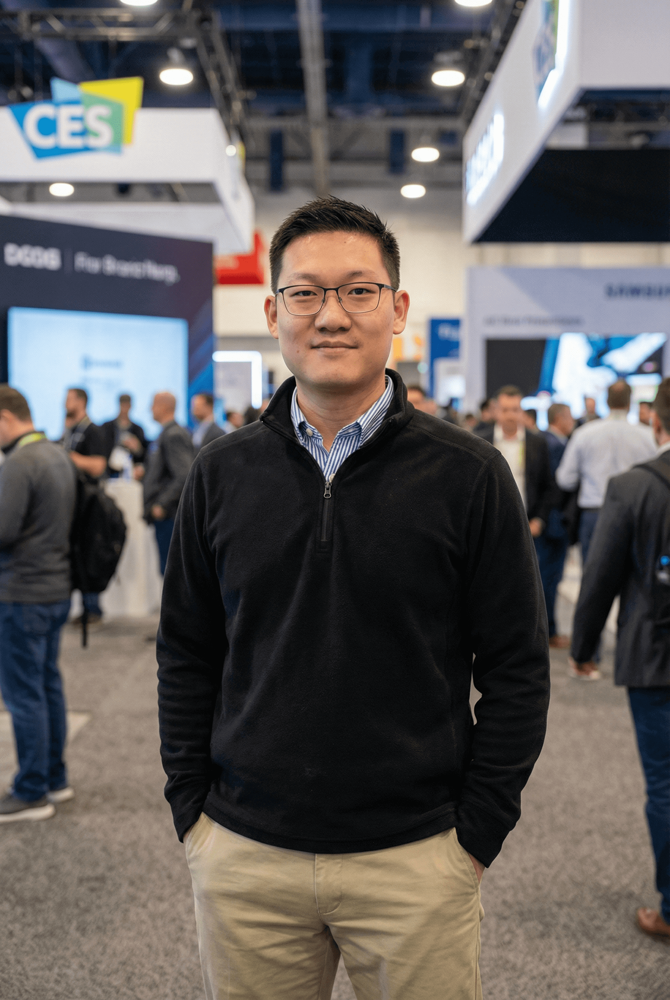

*"How about the future? Just move forward."*

## First Principles Thinker - Building, Solving, and Moving Forward

**Leo(Wenzhuo) Zhao**
M.S. Student in ECE @ University of Pittsburgh
Ex-Field Application Engineer (Consumer Electronics)

I am a Master's student in ECE at the University of Pittsburgh with a strong background in embedded systems and technical support. With 2+ years of experience as a Field Application Engineer (FAE) in Shenzhen, I specialize in bridging the gap between R&D and client applications.

<!---
bu77erzhao/bu77erzhao is a ✨ special ✨ repository because its `README.md` (this file) appears on your GitHub profile.
You can click the Preview link to take a look at your changes.
--->
